## 2024

### 3.19

[《就是要狠狠定下完不成的目标》](https://mp.weixin.qq.com/s?__biz=MjM5NjM5MjQ4MQ==&mid=2651665995&idx=1&sn=9992461cae7e9b1e7fba1460e68341e7&chksm=bd106d058a67e413cafac54dfb40d2a9f635e52d33c884770d442c2fd41d1a9c13d5bbfed1d7&scene=21#wechat_redirect)

那么，到底应该怎么制定一个合理可执行的目标？

试试“SMART原则”。

> Specific（具体的）
>
> Measurable（可衡量的）
>
> Attainable（可实现的）
>
> Relevant（相关的）
>
> Time-Based（有时间限制的）

**用SMART原则，你可以把一个朦胧的想法，翻译成了可量化、可操作的目标。**


老板，心里要装着全局。**你是在沙盘上定决策的人。**

管理者，应该理解你的每一摊业务，把目标准确翻译成任务。**你是指挥攻打山头的人。**

员工，应该要把任务的完成，转化为成长的实现，坚持做难而正确的事情。**你是攻下山头的尖兵。**

**在奔跑中成长。**

----

### 3.21

所有暴利，都在暗中标好了价格。白酒如此。茶叶如此。古董如此。玉石如此。红木如此。人生如此。共勉

---

### 3.22

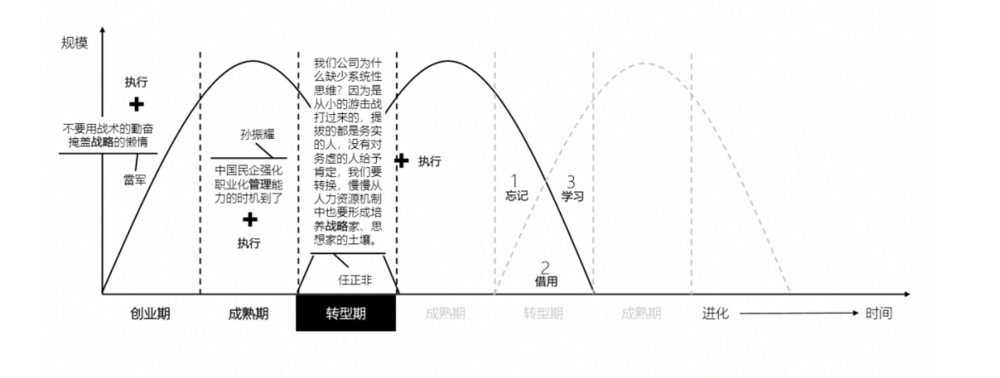


**你只需利用刷牙、搭地铁的时间， 一天掌握一个概念，一周补强一个学科，一季更新一个体系，一年完成一次升级。**

**你就会发现，真正难的，从来都不是爆发的瞬间。**真正难的，是日复一日的坚持。


**看书，就是在锻炼你的精神肌肉。**既然是锻炼肌肉，那么每个部位都要训练，每种方法都要尝试。只有尝试过，你才能找到最适合自己的路径。

而当你发现自己看不懂一些东西时，不要恐惧，更不要拒绝。你要拥抱这些陌生的知识。

因为，你开始点亮了原本黑暗的地图，认知开始得到了提升。

然后，你会拥有更多的认知模型和框架。


理性的赌徒精神 --- will yin

-----

### 3.29

丹尼尔·卡尼曼  经济学奖的心理学家 , 著作 《思考，快与慢》和《噪声》。

**决策错误=偏差+噪声**

#### 五个偏差

- **第一，锚定效应（Anchoring Effect）**: 卡尼曼的研究表明，在做决策时，尤其是在做自己不确定的数值估计时，人往往会被第一个看到或听到的数字所影响，不自觉地把这个最初获得的信息当成一个“锚”，作为判断的参考点去做****决策。**

  **这，就是锚定效应**

  

- 第二，代表性偏差（Representativeness Heuristic）:  **卡尼曼的研究表明，人们在看到一个东西时，总会联想和这个东西表面上相似的其它东西，并且以此为基础，简单粗暴地把它们归作同一类，去做判断，做决策。这，就是“代表性偏差”。

- 第三，可得性偏差（Availability Heuristic）:  **卡尼曼的研究表明，我们的大脑，有时会因为信息的易获得性，而过度估计其重要性。**

- 第四: 损失厌恶:   卡尼曼的研究表明，人们对于收益和损失的感知，是不对称的。这，就是损失厌恶。

- 第五: 框架效应:    卡尼曼的研究表明，人们对信息的接收和处理,会受到信息呈现方式的影响。换句话说，同样的信息，换一个说法，给人的感觉就完全不同了。

5个偏差，本质上，都是认知上的偏差。认知偏差了，决策就会有偏差，得到的结果自然也会有偏差。

#### 三个噪声

- 水平噪声: **概率上，同一个情境下，不同的人，做出的判断可能有差异。**
- 模式噪声: **同一个人，在不同情境下，做出的判断也可能有差异。**
- 情境噪声: **很多偶然的，外界的因素，也会对判断有影响。**

**但行好事，莫问前程。**

这句话，原句是“但知行好事,莫要问前程。” 出自五代冯道的《天道》。

译文里给它的注解是：做好当下的事情, 不要管将来会有什么样的结果。

但或许，我们这个时代的人听这句话时，是倒着来理解的：

先，莫问前程。

将来有什么结果，别问。因为，问了也左右不了什么。

再，但行好事。

做好你当下的事，就好。至少，做好你认知以内的事。

**莫问。但行。说得真好。**

----

### 4.1

**只要，价格还有差别，供求还不平衡。** 黄牛就会在

**套利的底层逻辑，不是粗暴的“套”，也不是简单的“利”，而是“供求失衡”。**

**很多东西都会变，但市场和人性，不会。**

----

### 4.8

自媒体的放大，触动流量密码

宁愿这样死，也不想死的时候无所事事，要死在你追求的东西上

鸡哥曾经看过一篇特别接地气的文章，是刺猬公社《实地探访山东新媒体村，农妇做自媒体收入破万》

澎湃新闻：目前这种不确定性环境下，年轻人该任何应对，你有哪些建议？
聂辉华教授：我提六条建议：降低预期，提高技能，锻炼身体，珍惜时间，学好英语，多看历史。

----

### 4.9

学习涵盖了自组织的方方面面，学习累积的经验模型越来越聪明的路径是学会如何学习，思考如何思考。

----

### 4.11

**在红利期，建立起复利循环。**


我们也可以用一个著名的“鸡汤”段子，来直观感受一下复利的威力：

假设，你的初始能力水平值是1，那么，根据你未来一年内努力与否，理论上会出现2种情形：

- 情形1：你每天维持原状，原地踏步。那么，一年之后，你的水平值是：1×（1+0）^365=1。
- 情形2：你每天学习一点点，进步1%，一年以后，你的水平值是：1×（1+0.01）^365=37.78。

情形2就是一个典型的“复利”情况。它意味着：如果每天投入1%的努力“利息”，不断利滚利，那么，1年之后，能力就会变为年初的37.78倍。

顺着这个思路，如果我们对复利公式进行拆分，还能得到一个启示：

**在投入时间相同的情况下，每天持续投入的资源越多，复利效应越明显。**毕竟，相比1×（1+0.01）^365=37.78的惊人结果，1×（1+0.02）^365=1377.41则更加夸张。

到这里，或许你就明白了，为什么爱因斯坦会把复利称为“世界第八大奇迹”了

----

### 4.12

#### 米村拌饭 扩张速度为什么如此快?

①**合伙经营模式下低成本快速扩张**
**合作直营**：米村拌饭总部只以技术入股的形式参与业绩分成不出资投资🆕门店，投资成本由外部合伙人and公司内部指派的区域经理店长等人共同承担，类似于华莱士，🉑分散前期投资风险
门店开设和管理🈶明确划分，选址由外部合伙人负责，日常运营管理由内部指派的出资人管理
②**门店菜品标准化**
米村拌饭将菜品数量进行精简，≈20道菜，并且是中式快餐中标准化程度高的品类
预制食材不会对口味造成影响，绝大多数食材是由中央厨房统一配送，保质期大多七天以上
中央厨房同一配送和门店烹饪低技术要求↓人力和经营成本
**预制菜为什么还能🔥**
①烹饪方式削弱预制感
大多是滚烫的石锅铁板作为容器，让人忽视其实是预制菜的现实
②选址和服务提高高性价比的体验
米村拌饭非负一楼，而是三四层的中式正餐聚集地，均价只有30💰性价比高，3💰穷鬼套餐也在媒体上🔥了
服务上，门口专门引导的店员和等待区，对门店服务or菜品不满意的，🈶承诺免单or🆓兑换的服务
困难😫
①能否继续吸引🆕合伙人开店
大多数人倾向于单店投资低于50w的项目，而米村拌饭成本是100w到120w，今年其合伙出资比例又↑，至少出资85w，预计回本周期也比较长
②南方扩张
米村拌饭九成左右门店在北方，需要与南方地区生根多年的本地米饭🍚快餐品牌竞争，还要考虑不同地区的口味需求


----

### 4.15
```
什么时候应该跳槽？

当工资倒挂的时候，当成长倒挂的时候。
```


** 平庸的人会选择留下，但是优秀的人，会果断离开。**


** 跳槽，去一个压强更高的地方，加速度更快的地方，成长更多的地方，也是想要成大事者的极佳策略。**

----

### 4.17


**像人，更像人，极其像人，完全像人。**

**好感，更多好感，极其排斥，恢复好感。**

**这，就是恐怖谷。**


赚钱和努力没关系
每个人都努力的结果
就是大家的努力都白费

----

### 4.18

岁月静好只是片刻，大多都是一地鸡毛

----

### 4.22

我可能不给别人打工，不能允许自己失业。**把失业这个词从咱的字典里抹掉，工作，必须得工作，干任何事都可以。**


所以眼光看远一点，千万别给自己一个标签，什么婚姻失败？那就是一个配不上你的 男人/女人 走了，就这么简单。


你只要跨过不怕，你就赢了。人生赢家，写作赢家。

---

### 4.23

**普通人等待好运的降临，而高手寻找好运的方法。**

**但激励的过程，一定是鼓励员工追求自己的目标，顺水推舟地达成企业的目标。**

**销售思维，就是时刻寻找“互利共赢”的机会。**

**经典的力量，足以穿越漫长的时间长河。**

**企业里没有任何人真正靠得住，甚至包括老板。靠得住的，永远是流程。**

**桌前纹丝未动，世界呼啸而来。**

----

### 4.24

**做产品，就是把千钧之石推上万仞之巅，获得尽可能大的势能，然后在最高点推下去，用营销和渠道减小阻力，把势能转化为最大的动能，获得尽可能深远的用户覆盖。**

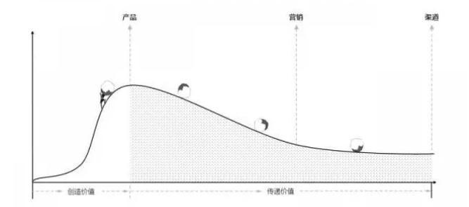

**你陪你客户喝下去的那些酒，都是你因为做产品的时候没有流过那些汗**

**不偏不倚的自我认知，是如此的重要。在产品、营销、渠道这三件事情上，你把一件做到极致，就可以获得巨大的成就**

---

### 4.26

**在一个充满竞争、越来越难赚钱的时代，都在不断提高自己的竞争力，\**让自己变得更强壮\**。**

**耐下性子，****充分了解当地人的需求痛点，逐个解决**

**持续的技术聚焦，不断的研发投入。**

-----

### 5.6

表面上看，做品牌的逻辑是“先找准定位，再集中发力”。

**但实际经营过程中，经常是做着做着，连你自己都迷失了自己的优势是什么。**

**需要不断从客户利益出发，去反思、梳理、反求诸己。**


**但一旦你想“做好”，这就变成了一个“心理学”问题。**

**如何用自己的行为，去真正激发人们心底里的“善意”。**

----

### 5.8

阅读 数理/推理, 批判性思维

不要太守规矩是当代年轻人最需具备的素养, 知道什么时候不守什么规矩

`赐我勇气去改变我所能改变的一切`, 请赐我宁静去接受我不能改变的一切,  并赐我智慧去分辨两者的不同

----

### 5.10

你想要让鸡长1斤肉，就需要喂它2斤左右的饲料。你喂饲料的量和它长肉的量，有种比较恒定的关系。这种关系就叫作：料肉比。鸡肉的“料肉比”，大约是2:1。

2:1的料肉比，高吗？不高。猪肉要高一些，大约是3:1。牛肉更高，大约是6:1。羊肉还要高，大约是10:1。这也是为什么，羊肉比牛肉贵，牛肉比猪肉贵，猪肉比鸡肉贵。因为喂的饲料多啊。所以总体来说，料肉比越高的肉，越贵。

**用大量高质量的输入，来驱动少量高质量的输出。**

笔记: **“永不遗忘，又能随时调取”的存储，就是你的：第二大脑。**

第二大脑的“文具”：**印象笔记，和电子马克笔。**


----

### 5.20

**但低价本身，并不是壁垒，竞争对手做不到的低价才是**

**指标单一、不断赛马、舍得给钱。**

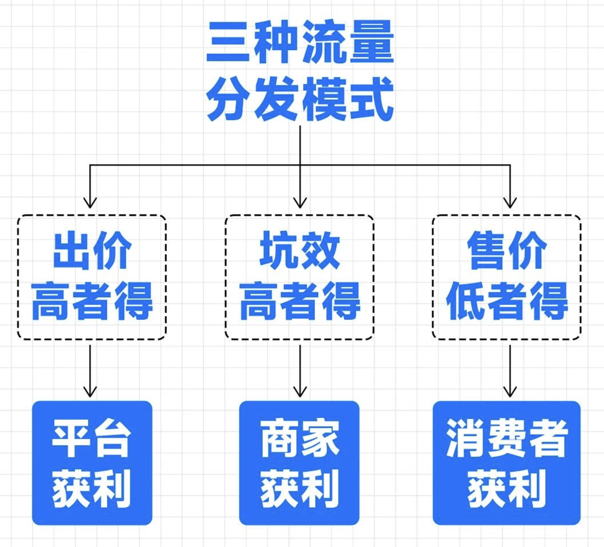

**想让团队有执行力，那就给指标单一、设计竞争、把钱给够。**

**想做出高质量决策，那就少做决策、明确最核心的战略，不做“既要又要”的决策。**

**想真正服务用户，那就设计系统，让自身与用户共同获益。**

**想提高效率，哪怕你做不到拼多多的“不装”，至少可以减少“装”的成分，丑话多说在前面。**


>  所谓的自律，就是去对抗那些廉价的快乐

>
>
>奶茶甜，是因为它含糖；肉很鲜，是它因为含有氨基酸，而氨基酸是构成蛋白质的基本单位；兔头猪脑很香，是因为动物内脏含有胆固醇，可以理解为脂肪。
>
>糖类、蛋白质、脂肪，是为人体提供能量的三大营养物质。
>
>吃下去，立刻就会开心。因为基因为了让你这个生命体延续，就必须要刺激你这个能够行动的人，去摄入多一点的糖。

**自律，真的是太难了。自律，都是反人性的。**, 这个时候，你就需要一种延迟满足的能力。, 

延迟满足感的能力怎么训练呢?

- **建立自我效能感**:  自我效能感，就是自己相信自己，我能做成我想做的事情。
- **警惕甜点位。**
- **培养一些运动的爱好。**

----

### 5.23

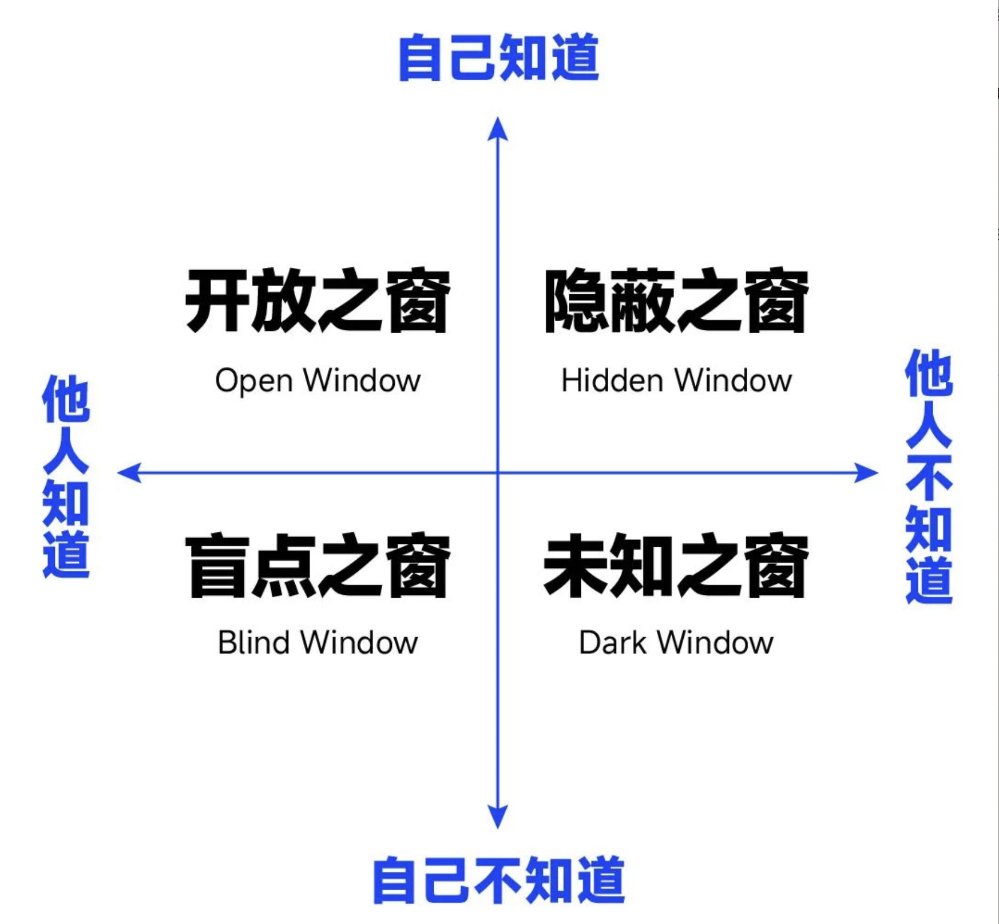

被抖音点名的私董会，到底是什么东西？

**主流观点认为，私董会是来自于大洋彼岸的一种聚会形式，作用是帮助参与者发现盲点，照见自身的问题。这种横向学习的方式，特别适合需要提升领导力阶段的创业者。而想要办好一场私董会，不仅需要前期建立充分的信任，参与者也要放下自我，怀着利他的心。**

----

### 5.27

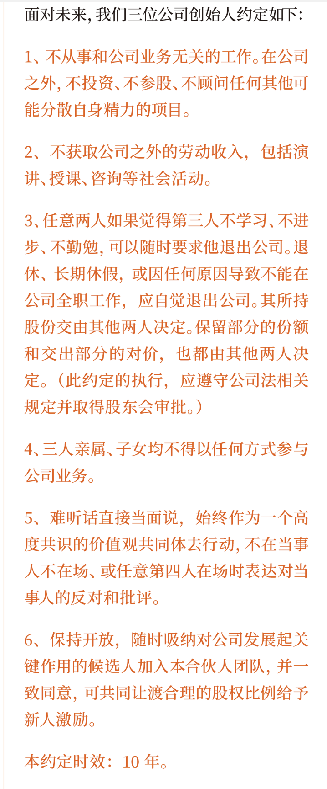

### 5.29

西方人的审美从神开始，中国人的审美从玉开始。

在企业里面，很重视所谓的“汇报关系”。`我汇报给你，你再汇报给上级领导，你就对我有权力`。因为我这里的信息只有经过你，才能被组织正式接收和处理嘛。那如果你的领导，要求我直接汇报给他，那好了，我的信息就绕过你了，你对我的权力其实就消失了，不管名义上你还是不是我的领导。很多领导非常介意下属`“越级汇报”`，信息流绕过了他的位子，`削减了他的权力`，就是这个原因

吴军老师讲，硅谷有一位很有名的投资人，失误率很低。他在决定投资之前，除了像其他投资人一样认认真真做背景调查之外，还会做一件事，晚上9点之后到那家公司外面去转转，看看停车场里停了多少辆车，楼里面是否有很多人在工作。这多少能说明这家公司的精神状态。这个做法其实就是换了一个维度对公开信息进行了`交叉验证`。

### 6.03

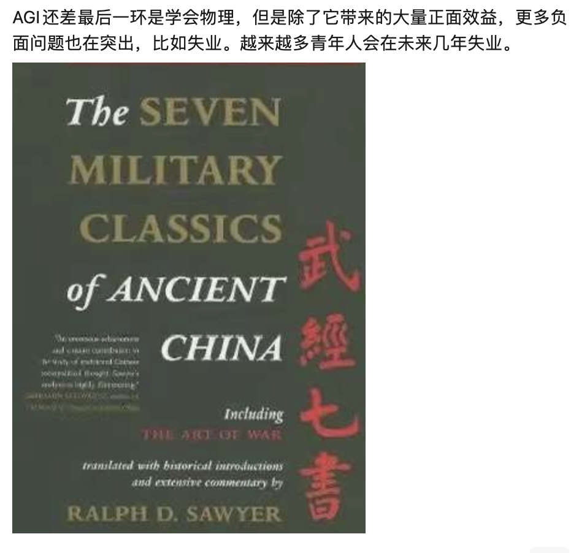

### 6.04

- 尾货当然便宜。这种因为滞销、过季、微瑕而导致的便宜，今天就叫做：软折扣。

- **那就把“货源不稳定”，当做一场“丛林里寻宝”。**这段话的意思就是说：**买不到很正常。这就跟探险一样，是娱乐的一个部分**

- **不同的营业时段，必须满足不同人群的不同需求。**

**只有别人觉得做不到的事，才能不被模仿。**

### 7.08

**不要走在主航道的前面，而要走在它的下面，或者旁边**, 你们淘金，我们卖铲子。

个人可能因为兴趣而买。企业一定因为效率而买。toB的企业，对效率更加敏感。人工智能的核心价值，就是提效。什么是提效？就是用20万，省下100万。这样的系统，一定是未来。

这个逻辑有意思了。大部分中国人都会写字，那你学写字还有用吗？有些能力，是别人会你就不用会了的。但有些能力，是别人会，你更要会的。因为编程，就是一种“语言”，与人工智能这个物种沟通的语言。未来我们必须与另一个物种对话。学习编程，不是为了编程，而是为了理解这个物种。

水面变化越快，就越要学底层的东西。因为底层的数学不会变。为什么不会？因为数学，不会就是不会。

### 7.10

**刚到新环境，如何让大家喜欢我？**

> 在一个成熟的公司里，在一个正在向上走的团队里，好人，大概率是没空搭理新人的。
>
> 首先，你还是要先把该做的工作任务做好。先坐稳自己的位子，展示自己的实力。
>
> 其次，逐步展示自己的工作能力，能够胜任之后，再慢慢相处，让人不断觉得你这人“能处”。
>
> 不要着急让所有人一下子就喜欢上你。

**遇见“我是为你好”，怎么办？**

> **首先，你要诚挚地感谢。**
>
> **但接着，你要表明自己的立场。**
>
> **讨价还价。**这个事我可以接，但是现有的活，我可能就没有那么多精力兼顾了，您得给我松松担子。这个机会我可以放弃，但下个季度，有个其他的机会，我想去参加。
>
> 记住，当你拒绝了“为你好”的建议之后，千万记得：**一定把事本身干好。证明你是对的。**
>
> 最后的最后，如果实在是所有方法都尝试了，还是不行，那送你一个终极心法：**永远都保有离开的能力。**

### 08.13

成事靠认知，而不是靠知识：给管理者的7个建议

- **一家公司，不能靠牛人**:   让团队的能力长在流程上，长在沉淀下来的方法论上，而不是长在少数“牛人”身上。
- **快速纠错，而不是不出错**:   你要做的，不是建立一个不犯错的机制，而是建立一个能快速自我纠错的机制, 一个真正厉害的人，不一定是多么天赋异禀，可能仅仅是因为他踩的坑足够多。
- **价值观，就是一种场**:   种植观念，打通价值观。价值观，就是一种高能量的场。不同过去的人，在同一个场里，就能良性互动。用价值观一起看未来，而不是沉溺于过去的经验和成功之中
- **建立有漏洞的规则**:  作为管理者，做规则，有时候要留一点漏洞。留漏洞，就是为了让人钻空子, 让规则服务业务，不要让业务去服务规则。
- **成事靠认知，而不是靠知识**: 知识的作用，是用来训练认知，解决问题，而不是让你“显得很厉害”。观察，只能得到表象。洞察，才能得到本质。天天很忙碌的人，智慧反而不一定增长。因为他看上去忙碌，但只不过是一直重复罢了。

### 08.30

该怎么办？2024结束前，我们还能为自己做点什么？

- 很多事情，看上去特别微小，特别平常，特别简单。但恰恰是这些微小、平常、简单的事情，拉开了人与人之间的差距。

- 用一场庄严的仪式，做出郑重的承诺。用五三一的方式，找到下一阶段的战略。
- 通过多看书和多见人，提高自己的认知。
- 通过训练和舒压，做大自己的心力。

### 10.23

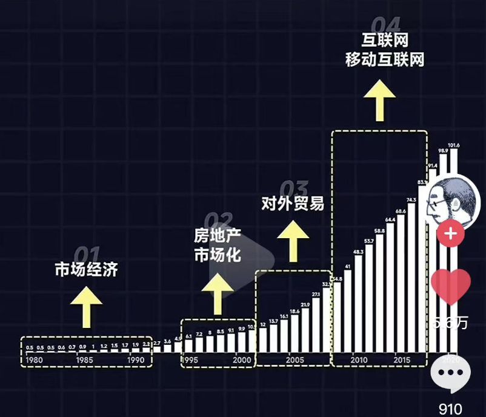

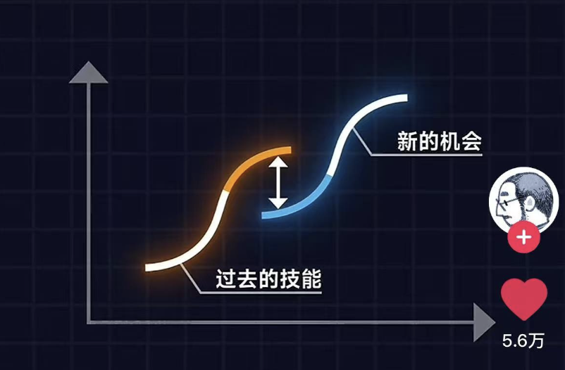

替代：国产品牌替代外国品牌，平替
融合：AI和实体产品或者硬件的融合，宠物经济、AI赛道
出海：利用平台直接从tb-tc，跨境领域的公司
下沉：在供给不足的地方提供优质的供给，提供高质量服务


### 10.29

https://mp.weixin.qq.com/s/n2Qbt620i45d-6z710-v3Q

什么叫简单？就是想清楚，我最重要的目标究竟是什么？更重要的是，我为了实现这个目标，究竟要做出怎么样的取舍？

要把复杂的事做简单，而不是反过来。


### 12.04

**催产素:**

简单说来，当你感受到爱的时候，你才会分泌催产素，而催产素能让你心情愉快，用最大的善意拥抱这个世界，拥抱创业的过程。

**肾上腺素:**

肾上腺素是由人体分泌的一种激素。当你经历某些刺激，或者承担巨大压力时，你的身体就会分泌这种化学物质。它会让你的呼吸加快，心跳与血液流动加速，为身体活动提供更多能量，使你的反应更加快速

**皮质醇:**

皮质醇俗称压力激素，是肾上腺皮质在应激反应里产生的一种激素。体内出现过多的皮质醇会让你的血糖升高、食欲增加、体重上升、性欲减退以及感到极度疲劳等等。

皮质醇水平偏高还会让你比其他人更容易焦虑、莫名其妙地生气，很多创业者后来得了癌症、抑郁症或心血管疾病，其实都与皮质醇的分泌量过高有关

催产素可以抵消皮质醇的负面作用，所以你得去爱别人，你才能分泌催产素，变得淡定、愉快。

---

“问题”有两种，一种是“汇聚性问题”，另一种是“发散性问题”。汇聚性问题是可以解决的，因为汇聚性问题多半拥有一个统一的解决方案，只要找到了这个解决方案，就能解决它。我们可以看到世界各地有许多发明都差不多，原理是一样的，因为它们都是汇聚性问题，是有固定答案的。

我们面对没有标准答案的问题的时候，只有一个解决办法，就是提高自己的认知水平。只有把认知水平提高了，让原本的发散性问题不再成为一个问题的时候，才会解决。这是发散性问题的解决方法。

所以，降低创业风险，其实并不是一件很难的事情，找到这样的矛盾去克服它就可以了。如果你连克服这个矛盾的动力都没有，不愿意去研究、想办法解决这个问题，那么你的创业之旅注定充满坎坷和荆棘。


### 12.05

那教练怎样传授才能让员工懂自己“懂”的东西呢？

有三个步骤：

- 先将经历经验化
- 再将经验方法化
- 最后在专家的帮助下实现方法理论化


---

## 2025

### 01.09

刘震云：人与人最浅薄的关系，就是一件事，你没顺着他的心，他就忘记你所有的好。


海恩法则

> · 事故的发生是量的积累的结果。
>
> · 再好的技术、再完美的规章 ， 在实际操作层面也无法取代人自身的素质和责任心 。

薛定谔的猫

> “薛定谔的猫”告诉我们，事物发展不是确定的，而是量子态的叠加。

墨菲定律

> · 任何事情都没有表面看起来那么简单 。
> · 所有事情的发展都会比你预计的时间长 。
> · 会出错的事总会出错。
> · 如果你担心某种情况发生，那么它更有可能发生 。

蝴蝶效应

> 世界会因一些微小因素的变动，而发生很大的变化。

熵增原理

> “热力学第二定律”（熵增原理）告诉我们，世界总是在变得更加混乱无序。 

### 01.10

走暗路，耕瘦田，进窄门

### 02.11

低水平勤奋


### 03.02

不能 只见树木，不见森林


“四行日记’

- 第一行是“事实”: 回顾今天发生的事，从中选出一件自己认为非常重要的、印象深刻的事。用简短的文字只陈述“事实”，不要带有任何个人意见、观点或者其他无关的主观内容。
- 第二行是“发现’: 记录“大发现”，比如从事实中偶然感悟到的小小的法则，或者是通过事实领悟到的普遍原理或原则。
- 第三行是“教训”: 写下类似于应该铭记于心的“警句’的关键词，从而使“发现”升华为永生难忘的智慧。
- 第四行是“宣言”: 只要有所发现并吸取了教训，自己的思想和行为就会自然而然地发生改变，成为应该达到或者实现的“目标”。

### 03.03

合格的管理者需具备六种基本能力，即“六大原力”：沟通力、执行力、抗压力、眼力、计划力、意志力。

### 03.14

优秀的作品都是形式（form）和功能（function）的统一。**形式必须服从功能，功能决定了形式**，英文叫做“form follows function”。这个就是低代码为什么不能兴起的原因 (https://mp.weixin.qq.com/s/sHbR9Y7EZYkWrcfiNNjXhQ)


自从有了 AI，我发现自己不再担心项目对我来说太大、太复杂，或者项目使用了我不了解的技术或编程语言，一切都变得容易得多。我正在重新审视一些我曾认为太复杂或超出我能力范围的业余项目，只要有时间，我就会去尝试。这是一个令人兴奋的时代。 -- 《有了 AI，你需要想得更大》[65]


### 04.22

价值导向驱动的使命和因亲身经历而产生的真正目标包含着某种深刻的美。这就是极简主义创业者的目标——在谋生的同时有所改变          --- 小而美

创业的真正魔力在于你以及你的企业能提高很多人的生活质量。那不必是几百万人，“足够”没有一个具体的标准，你说了算。  		--- 小而美


### 04.23

毕竟世界上的问题不会自己消失，而人可以解决它们。


先是创作者，再是创业者
要是把创业步骤写在纸上，看上去会非常容易。
1.你的理想客户是哪些？缩小这个群体的范围，直到不能再缩小为止。
2.明确你要帮他们解决的痛点是什么，以及他们为此愿意付多少钱。
3.设置一个严格的时间表，专心致志地设计一个方案，然后收取费用。
4.不断重复这个过程，直到找到一个可行的产品，然后围绕它扩大经营


- 你不应先学习，再开始，而应先开始，再学习。
- 极简主义创业者关注如何“尽一切力量盈利”，而不是“不计一切成本扩张”。
- 生意，是你为所关心的人群解决问题的方式，你也会因此赚钱。
- 先成为一个创作者，再成为一个创业者。


### 04.24

modern /ˈmɒdn/  

monetary/ˈmʌnɪtri/ 货币的

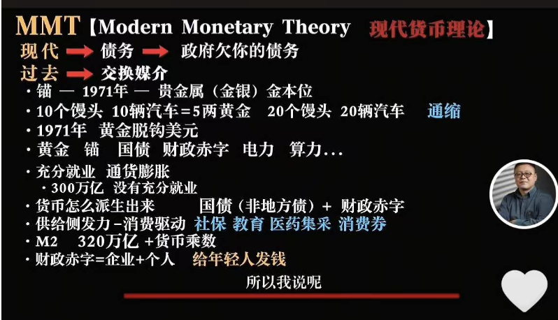

充分就业 + 通货膨胀

### 04.25

未来的根本特征，就是永恒感的丧失，取而代之的是短暂感。 ----托夫勒 《未来的冲击》

### 05.05

1. 贸易战这把火，会烫到每个普通人, 关税大棒打下去，最终疼的是老百姓的钱包。它最终，会通过物价、饭碗、投资账户，实实在在地“烧”到我们每个普通人身上。

2. 你手里的钱，可能正在被悄悄“稀释”, 巴菲特对美元的担忧，可能启发我们：**每个人，都要有管理好自己财富、让它保值增值的意识。**

3. 看不懂的东西，再热闹也不碰, 世界很大，机会很多，但属于你的机会，只需要那么几个就够了。

4. 耐心，不是犹豫的借口, **在机会面前****，最大的敌人往往不是风险，而是你内心的犹豫。**耐心，是面对模糊的武器，不是面对清晰的借口。

5. 慢慢变富，往往是最聪明的选择, 慢慢变富，远比“一夜暴富”然后“一夜回到解放前”强。让时间，成为你的朋友。像滚雪球一样，虽然开始慢，但越滚越快。

6. 找到让你心甘情愿投入的事, 只为钱工作，你可能只是在“出租”你的时间；为热爱工作，你才是在“投资”你的生命。钱是结果，不是目的；热爱，才是别人偷不走的竞争力。

7. 靠近那些你想成为的人, 巴菲特也建议，**年轻人要跟有智慧的人在一起，一起学习。**选择朋友和伙伴，某种程度上，就是在选择你未来的样子。

8. 好奇心，是大脑的保鲜剂, 94岁的巴菲特，思维还那么敏捷。凭什么？大会上，他在回答一个13岁孩子提问时，说出了自己的答案：**好奇心。**

   ````
   怎么做？大概有三点。
   读书，请教，独立思考。他
   特别欣赏老搭档芒格。他说，查理要了解一项东西的时候，会切入主题，真正进行思考。
   阅读，是给大脑“喂饭”；思考，是把饭“消化”成营养。
   所以，或许你可以：
   1）多读点能让你慢下来思考的东西。少刷点哈哈一笑就忘的段子，多啃啃那些需要动脑筋的“硬骨头”。
   2）养成打破砂锅问到底的习惯。看到一个结论，别急着点头，多问几个“为什么？”“是真的吗？”“有没有反例？”
   3）警惕那些“喂到嘴边”的答案。独立思考的过程可能有点累，但只有经过你自己大脑验证过的东西，才能真正成为你认知的一部分。
   你的认知边界，决定了你的世界大小，也决定了财富的天花板。
   ````

9. 幸福，来自于心态, 眼睛盯着缺口，看到的都是遗憾；心里装着拥有，感受到的才是富足。

10. 名字，是你最贵的资产, 巴菲特用一生的实践告诉我们，你最宝贵的资产，可能不是你银行账户里的数字，而是你的“名字”。也就是，**信誉和名声**。正如巴菲特当年所说：**建立好名声需要20年，毁掉它只需要5分钟。**

### 06.10

自律，就是驾驭多巴胺。

教育，就是塑造多巴胺。

管理，就是激发多巴胺。

商业，就是交易多巴胺。

### 07.09

你连世界都没有观过 哪来的世界观


### 07.11

[执行速度比任何时候都更加关键](https://mp.weixin.qq.com/s/nDnSpfBMeP1apRaO45zXvw)

- 虽然行业关注多聚焦底层技术，但真正的商业机会常在应用层。只有应用层盈利，才能反哺模型、算力与芯片的发展。同时，各层级也各有机会。

  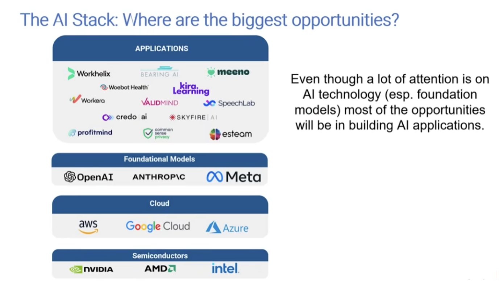

- 未来最具商业价值的机会，就在于将已有或新设计的工作流程转化为智能体架构。

- AI技术栈正在形成新的“智能体编排层”，承接底层模型与上层应用，帮助开发者更高效地构建复杂AI应用。

- 领域专家直觉，胜过数据滞后：深耕领域的专家凭直觉做出的产品判断，往往比初创公司依赖数据驱动的慢速反馈更具前瞻性。

- 验证速度就是竞争力：构建粗糙原型、验证想法是否成立，是AI时代创业成功的关键路径，避免过早优化和资源浪费。

- AI使得技术决策变灵活：过去技术选型是单向门，如今重构成本下降，许多架构决策已具可逆性，快速试错、灵活调整成为新常态。

- AI开发范式转向“拼积木式构建”：通过掌握提示工程、RAG、微调等模块化技术，创业者能像拼乐高一样快速组合出应用原型，实现指数级的创新组合空间。

- 编程成为新型表达力：即便AI能写代码，懂编程依然重要。它不仅是技术能力，更是清晰表达需求、引导AI完成任务的关键能力。`**我有一个可能颇具争议的观点：现在是时候让每个岗位的人都学习编程了**。`

- AI危险性被夸大了：AI本身中性，关键在于人类如何使用。安全不应被神化，负责任地使用AI，才是决定其利弊的根本。
- AGI存在认知误区：AGI概念被严重炒作。在可预见的未来，AI仍难以替代人类在创造力、判断力等多领域的独特能力。
- 开源是AI创新的护城河：开放协作是AI创新的基石，必须警惕以“安全”为名的技术垄断行为，共同维护自由开放的创新生态。

### 07.14

习惯把看透的叫规律，把看不透的叫命运

### 07.15

你是美好的，世界就是美好的

[理解AIGC、Agent、MCP的概念和关系](https://mp.weixin.qq.com/s/jTx_ktWeu5Ck8RDZ3b6iRw)

### 07.18

#### 稳定币:

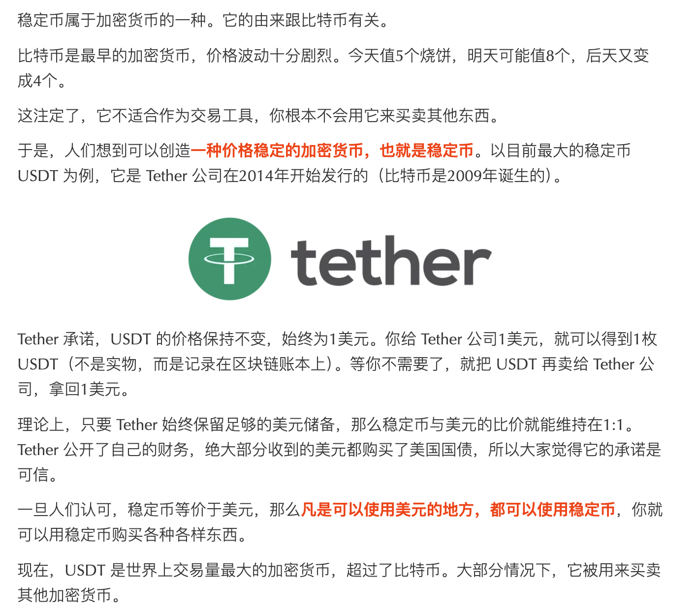

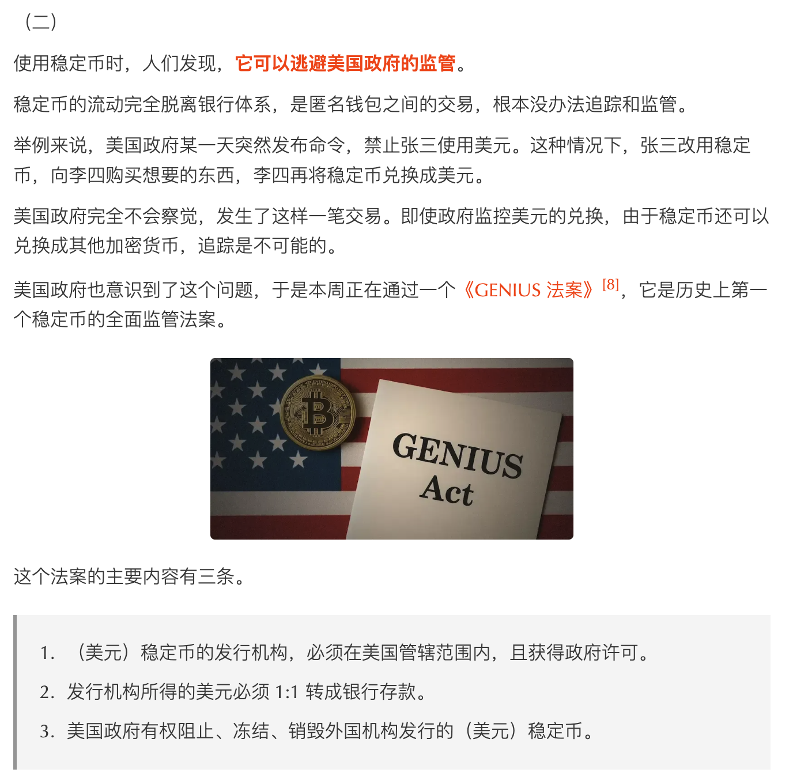

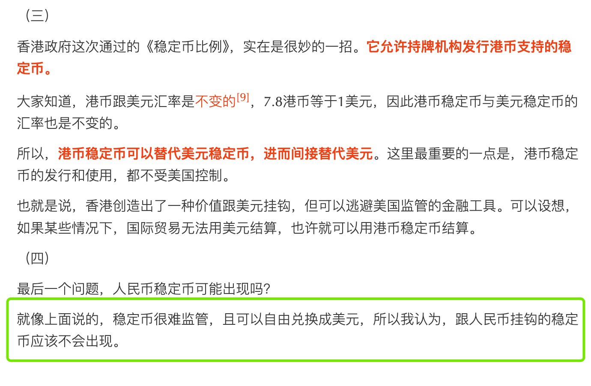

量变引起质变

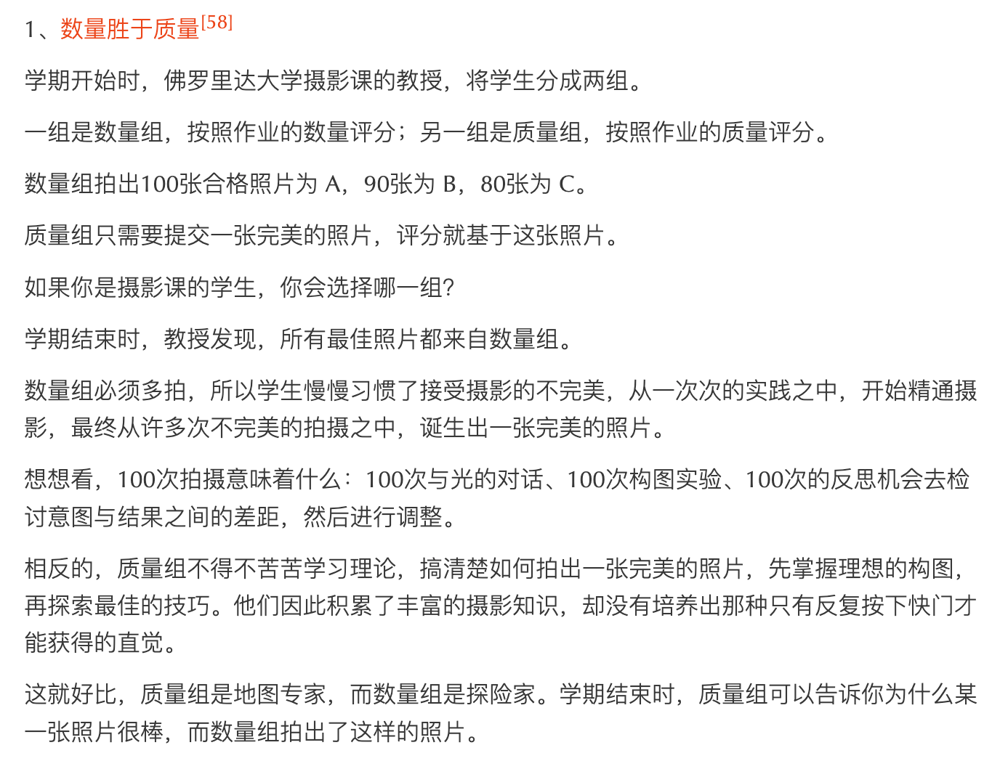

### 07.25

轻声细语说重话，不动声色显威风

### 07.31

荷花定律:

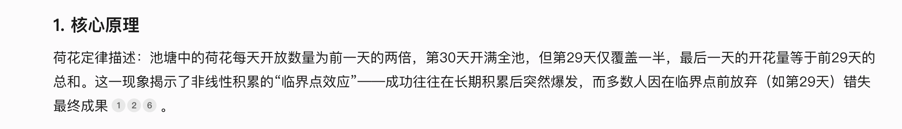

> 荷花定律与“竹子定律”（前期缓慢生长，后期爆发）、“金蝉定律”（长期蛰伏后蜕变）并称成功学三大定律，共同诠释“厚积薄发”的哲理


夜晚在被窝里哭泣，白天若无其事的人


### 08.01

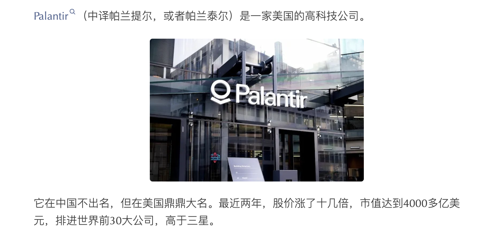

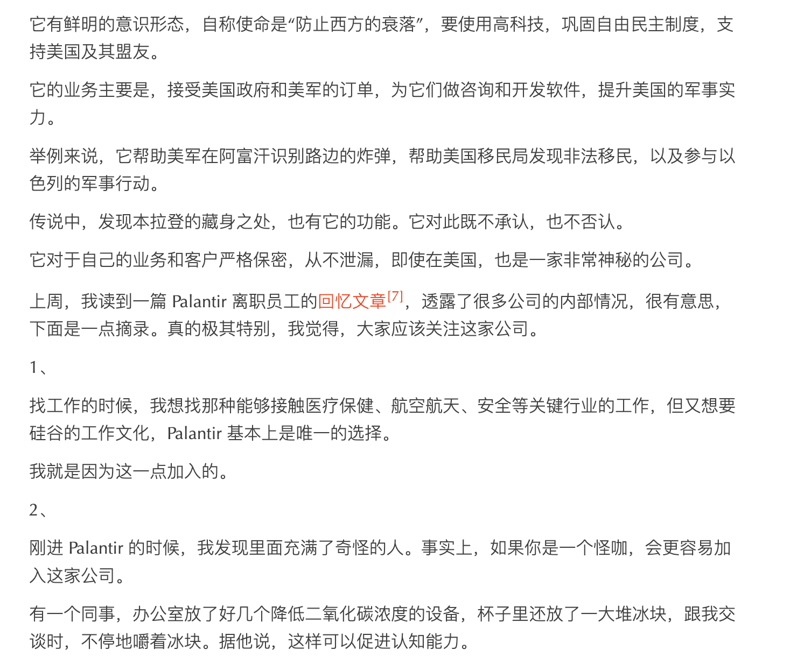

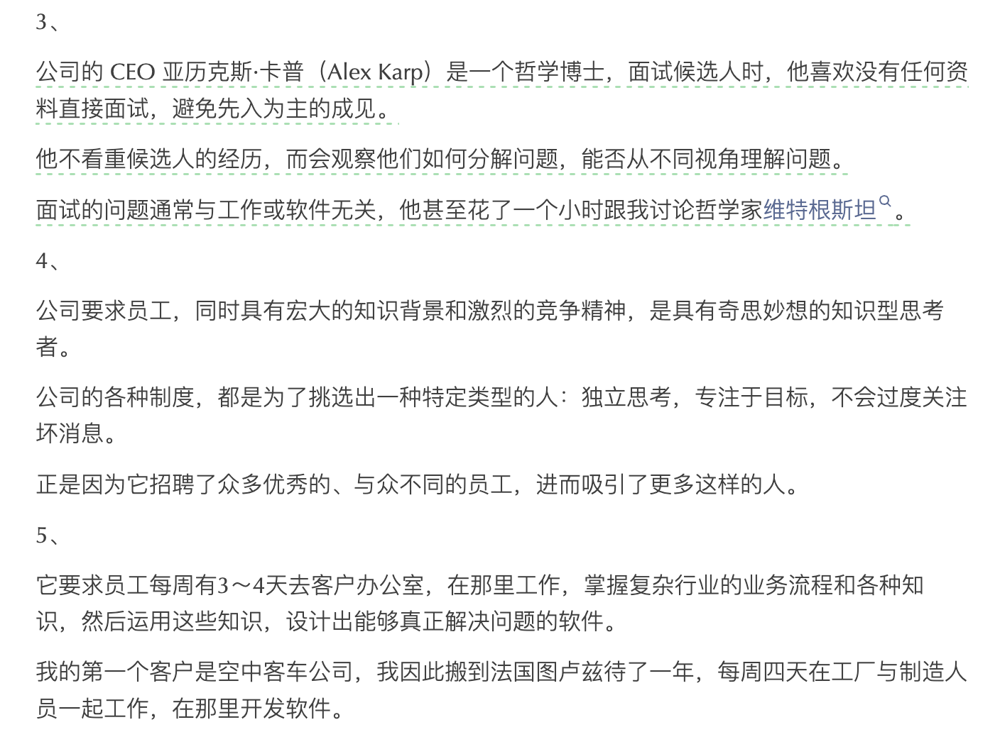

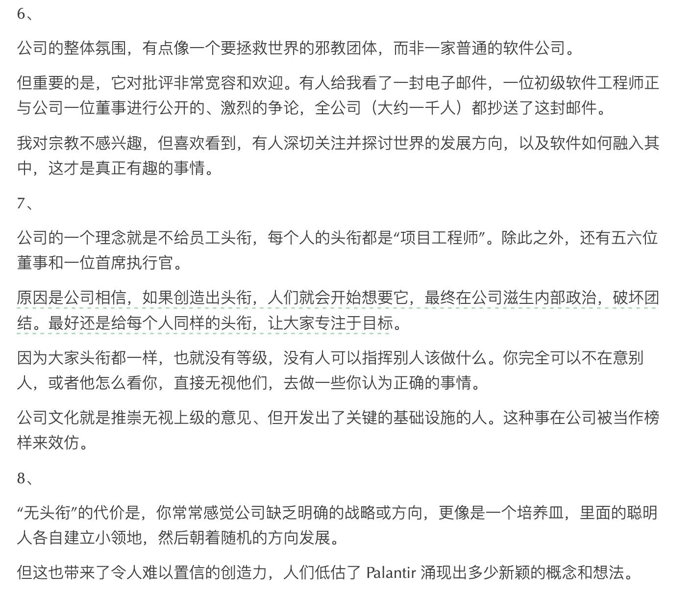

### 08.05

之前靠信息差赚钱, 现在靠认知差赚钱

一次深刻的本质洞察, 远远高于一百次辛勤的努力

### 08.06

世界是符合熵增定律的, 世界唯一不变的就是变化, 没有稳定的工作，只有稳定的能力

解决熵增的办法:

> 保持开放，终身学习，坚持自律，远离舒适，颠覆自我

### 08.18

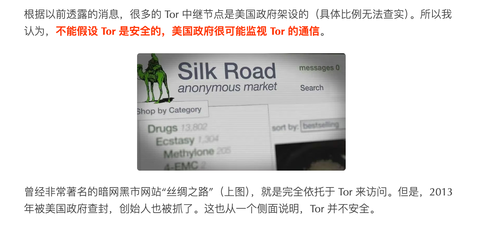

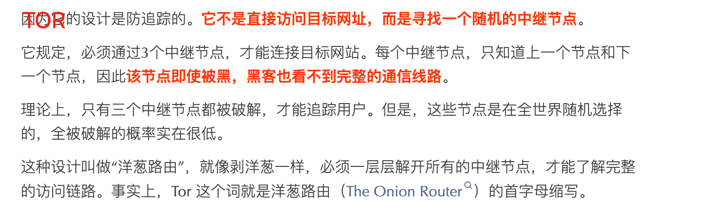

### 08.21

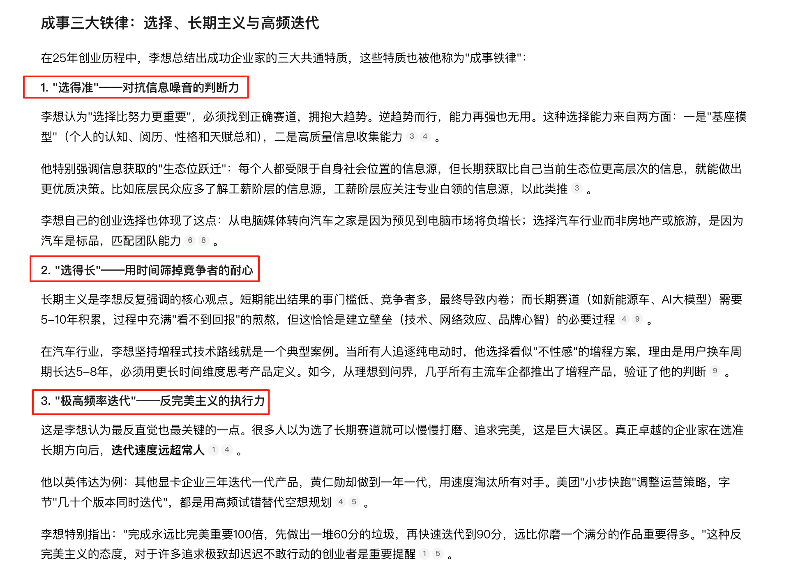

### 09.03

名次排列: 认知 能力 财富 欲望

人生两场重要的哭泣，一次是生命的诞生，一次是生命的升华

### 09.16

学会爱自己

凡所有相，皆是虚妄。若见诸相非相，则见如来

>所有的形象和现象都是不真实的，只有当我们超越这些表象，看到事物的本质时，才能真正理解“如来”的意义。

所有的聪明人都在下笨功夫

### 09.19

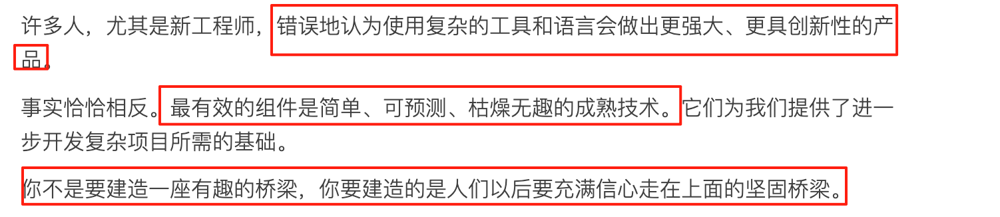

### 09.20

乍见之欢，不如久处不厌

### 10.09

世界上两种东西不能碰，百分之一人的利益，百分之九十九人的愚蠢

中线拼能力，长线拼心态

### 10.14

清醒时做事，迷茫时读书，独处时思考

### 10.15

顺其自然是竭尽所能后的不强求, 而不是两手一摊的不作为

### 10.20

“孤阴不长，独阳不生”是汉语成语，指单一因素无法促成事物的生成与发展。

### 10.31


这句话概括了他的信念：**要乐观，要看好未来**。因为乐观主义者会动手做事，而**世界是由动手去做的人决定的**。

回顾一生，我没有创造伟大事业，也没有创造出股东价值，但是**我得到了内心的满足感，而且不是以自我放纵的方式**。我以一种充满快乐、活力，没有焦虑、痛苦，也没有自负的方式，度过了人生。

### 11.03

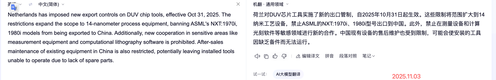

### 11.04

最后的目标:

> 穷人国家补 富人国内化 科技要突破 进口要替代, 这个过程快不了

### 11.05

消费靠孩子，靠女人，靠科技更新

### 11.14

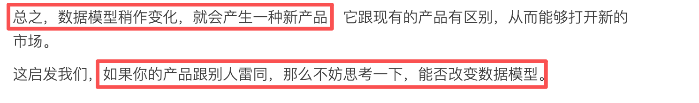

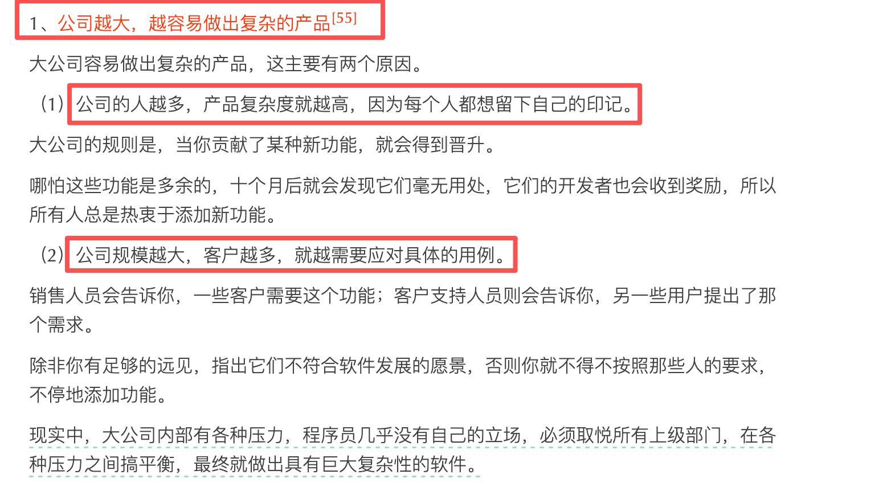

如果你向人们展示问题，又向他们展示解决方案，人们就会受到触动并采取行动。 -- 比尔·盖茨

### 11.17

自由努力的流浪，不改本色的回乡 ----- 五条人

### 11.28

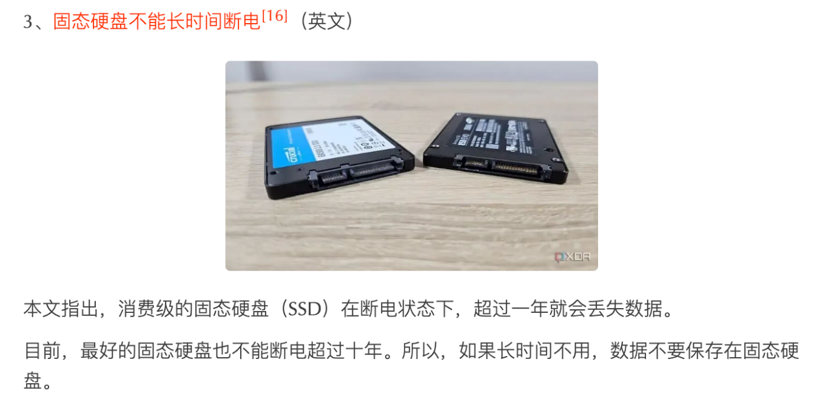

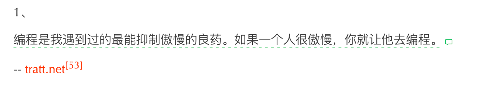

### 12.08

我们努力去学那些看似俗气的规则，不是为了变成自己讨厌的人，而是为了当你真正想捍卫某个理想时，手里能有那个谈判的筹码，身上能有那层保护自己的铠甲。

知世故而不世故，才是最毒辣的善良。

### 12.09

#### 脑灰质

脑灰质是大脑进行**信息处理和计算**的核心区域,主要负责:

- **感知处理** - 处理视觉、听觉、触觉等感官信息
- **运动控制** - 规划和执行自主运动
- **记忆形成** - 编码和存储新的记忆
- **情绪调节** - 处理和管理情绪反应
- **语言功能** - 语言理解和表达
- **决策与推理** - 高级认知功能、抽象思维
- **注意力和意识** - 维持注意和意识状态

不同脑区的灰质承担不同的专门化功能。

#### **脑灰质的可塑性变化:**

- 刻意练习通过持续、有针对性的训练,会导致相关脑区的**灰质密度增加**和**神经连接重组**
- 例如:音乐家的听觉皮层、运动皮层灰质更发达;职业棋手的前额叶皮层和顶叶区域更厚
- 这种变化是**适应性的**,大脑会根据使用频率和强度来优化资源分配

**关键点:** 这不是固定容量的"挤占",而是**动态的结构重塑**

#### 心理表征: 

心理表征是认知心理学的核心概念,指的是心智系统中对外部世界、概念、经验或知识的内部编码和呈现方式。简单说,就是我们的大脑如何"存储"和"表示"信息。心理表征可以有多种形式,包括:

- **命题表征**(抽象的语义关系)
- **意象表征**(类似图像的心理图景)
- **图式和框架**(结构化的知识组织)

刻意练习的本质就是**构建和优化心理表征**:

**初学者 → 专家的转变:**

- **初学者:** 心理表征简单、碎片化,需要有意识地逐步处理信息
- **专家:** 心理表征复杂、结构化、自动化,能够快速识别模式并做出反应

**实例:**

- **国际象棋大师:** 不是记住每个棋子位置,而是形成了"棋型"的高级心理表征,能瞬间识别局面的战略意义
- **医生:** 通过大量病例积累,形成了疾病症状模式的心理表征,能快速诊断
- **音乐家:** 对音乐结构、和声进行的心理表征,使他们能即兴演奏和快速学习新曲目

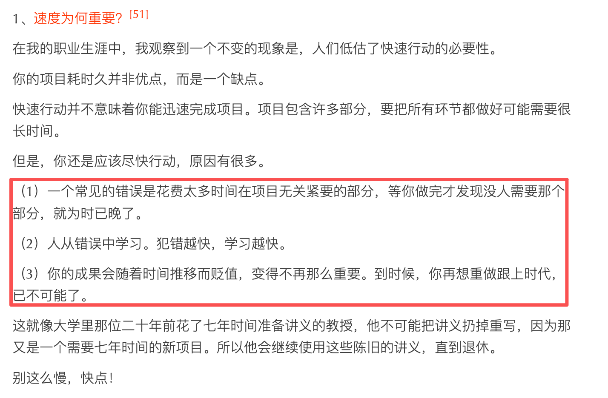

### 12.19

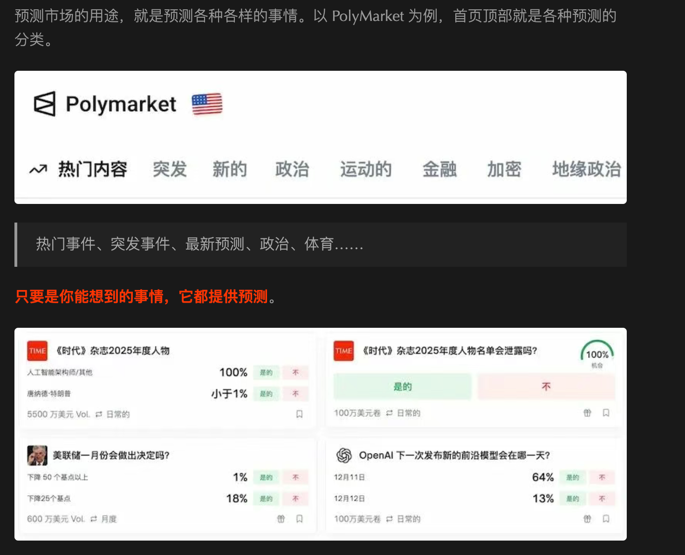

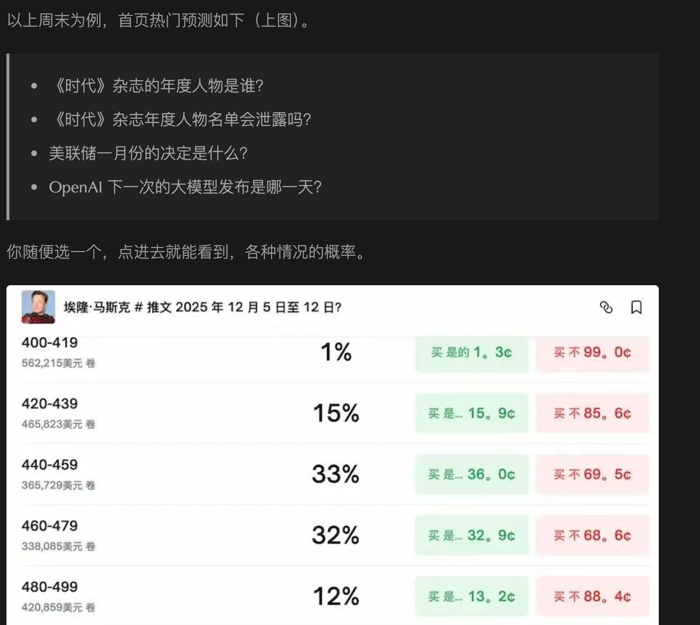

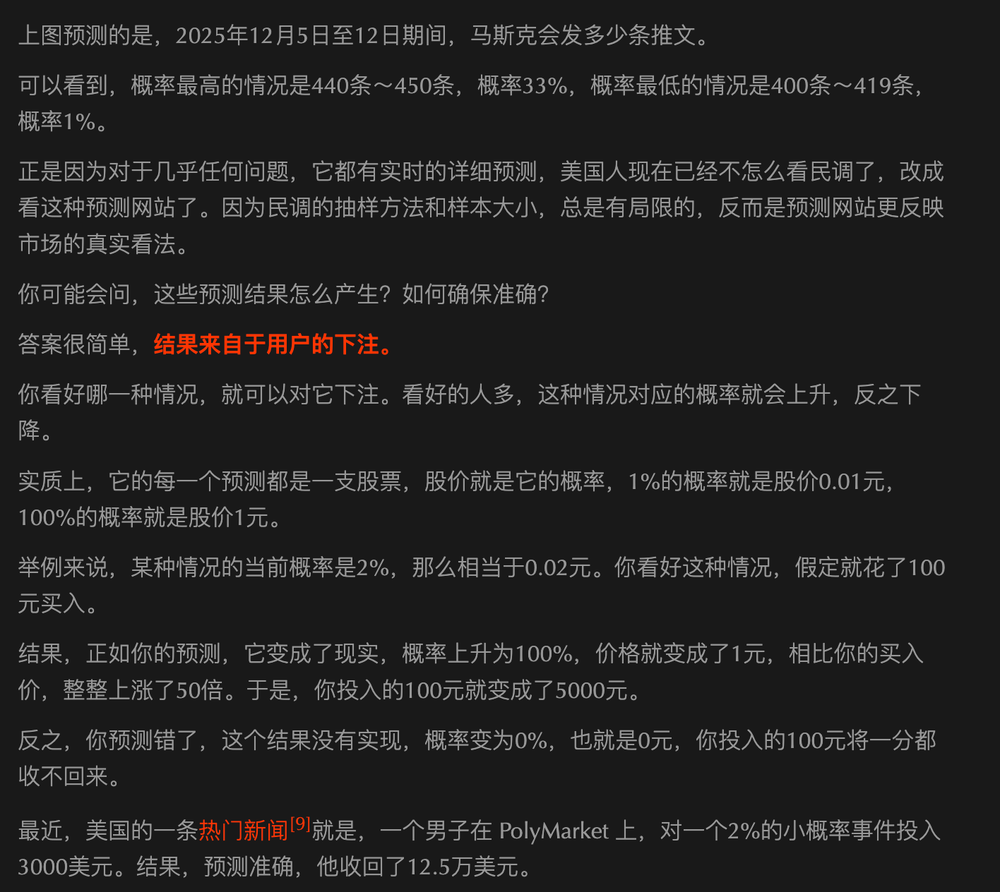

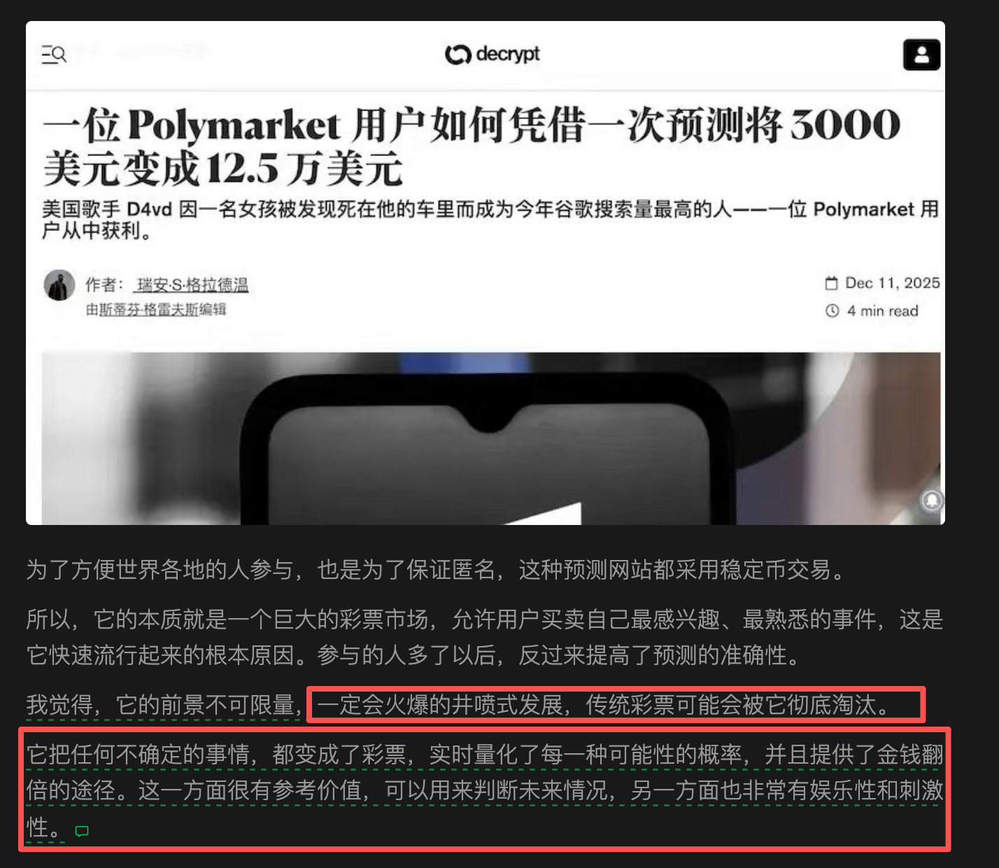

