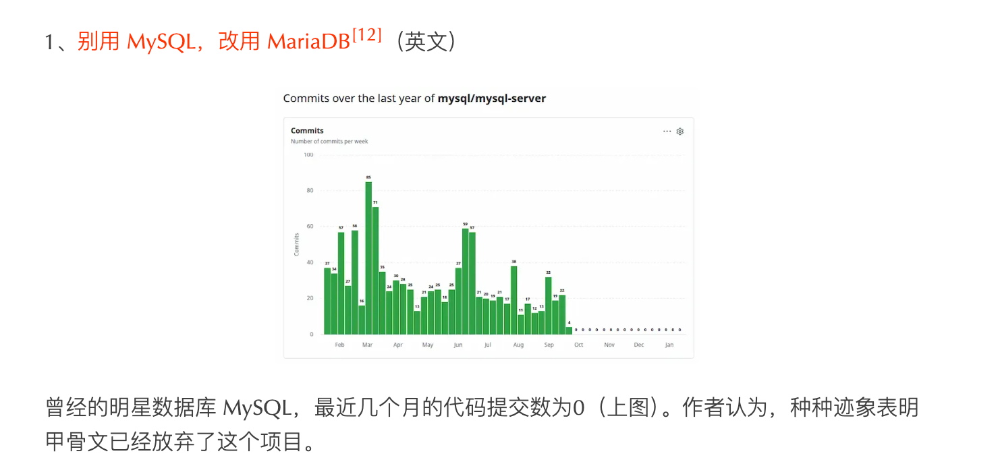

## 2026

### 01.13

**“人之患，在好为人师”    ----《孟子》**

> 意指人们的缺陷在于喜欢充当他人的老师，强调了谦逊的重要性。

### 01.15

**低水平的竞争=内卷**

### 01.16

人们陷入困境有三个主要原因：（1）行动力不足，（2）行动方向错误，（3）等待天上掉馅饼（幻想问题会缓解而拒绝采取行动）。     -- 《当你想摆脱困境》

### 01.21

把优势立在趋势上

### 01.23

低级的行动力是恐惧驱动, 中级的行动力是面包驱动, 高级的行动力是兴趣驱动

选择大于努力，但选择前你要拥有足够多的选项

[谷歌14年工作经验中的21条教训](https://addyosmani.com/blog/21-lessons/)

### 01.27

只要能被量化评估, 大模型就能到最好的那一档水平

### 01.29

年会，就是要兼容所有人的动机

### 02.03

金钱买不来幸福，但能缓解痛苦

### 02.09

未来的 AI 应用不会是"一家独大"，而是"多模型协作"——不同任务用不同模型，就像今天我们用不同编程语言解决不同问题一样。

### 02.20

微信朋友圈的发圈逻辑

展示理想 → 展示过程 → 展示结果。

> 这种发圈逻辑能为你节省很多不必要的交涉和沟通, 从而帮助你设立人设

### 02.24

惟以改过为能，不以无过为贵 		-------- 司马光《资治通鉴》

LGTM    --------  Look Good To Me 的缩写

### 02.27

#### 学习幻觉

**学习幻觉（Illusion of Learning / Illusion of Competence）**，也叫**能力错觉**，是指学习者在**被动、浅度**接触知识后，大脑因**信息处理流畅感**而产生的 “我已掌握” 的虚假自信，但实际并未真正理解、内化与应用知识。

**心理学定义**：由心理学家芭芭拉・奥克利（Barbara Oakley）等人提出，指**元认知偏差**—— 大脑用 “**熟悉感、流畅感**” 替代 “**理解深度、掌握程度**”，高估自己的学习效果。

#### 满分未必是好事

你能拿到满分，不过是因为被放进了一场**闭卷、有标准答案、边界确定**的考试里。

